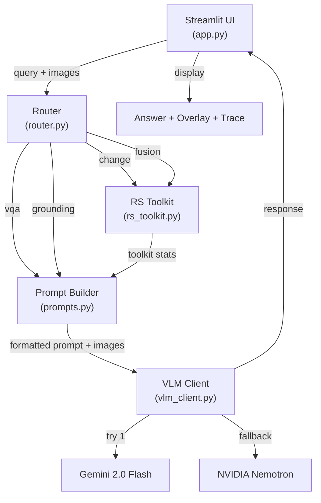

# GEORE MVP — Implementation Plan

Build an agentic vision-language assistant for remote-sensing image analysis, targeting a Smart India Hackathon pre-selection demo. The system uses Google Gemini's hosted vision model (with NVIDIA fallback) to deliver four capabilities: VQA, Grounding, Change Detection, and Optical–SAR Fusion — all orchestrated via a deterministic router with a fixed Python toolkit.

## User Review Required

> [!IMPORTANT]
> **API Key Handling**: You provided a Gemini API key in the curl command. I'll use it via the `google-genai` SDK (not raw curl) as specified in the prompt. The key will be stored in a `.env` file (gitignored). Confirm this is acceptable.

> [!WARNING]
> **NVIDIA Fallback**: The prompt specifies an NVIDIA fallback endpoint (`nvidia/nemotron-nano-12b-v2-vl` via `https://integrate.api.nvidia.com/v1`). Do you have an NVIDIA API key? If not, I'll wire the fallback code but it will only activate if you add `NVIDIA_API_KEY` to `.env` later.

> [!IMPORTANT]
> **Model Name**: The prompt says `gemini-2.5-flash`. Your curl command uses `gemini-flash-latest`. I'll use `gemini-2.0-flash` as the default (current free-tier Flash), configurable via env var so you can swap to whatever alias works.

## Open Questions

1. **Sample Images**: Do you have any sample satellite/remote-sensing images for testing, or should I include instructions for downloading freely available samples (e.g., from Sentinel Hub)?

## Proposed Changes

All files will be created under `c:\Users\ASUS\OneDrive\Desktop\Geore\geore_mvp\`.

---

### Project Configuration

#### [NEW] [requirements.txt](file:///c:/Users/ASUS/OneDrive/Desktop/Geore/geore_mvp/requirements.txt)
Dependencies: `streamlit`, `google-genai`, `openai` (for NVIDIA fallback), `Pillow`, `numpy`, `scipy`, `opencv-python-headless`, `python-dotenv`, `rasterio` (optional, for GeoTIFF support).

#### [NEW] [.env.example](file:///c:/Users/ASUS/OneDrive/Desktop/Geore/geore_mvp/.env.example)
Template with `GEMINI_API_KEY=` and `NVIDIA_API_KEY=` placeholders.

#### [NEW] [.env](file:///c:/Users/ASUS/OneDrive/Desktop/Geore/geore_mvp/.env)
Actual env file with the provided Gemini API key pre-filled.

---

### Core Engine — Router (`router.py`)

#### [NEW] [router.py](file:///c:/Users/ASUS/OneDrive/Desktop/Geore/geore_mvp/router.py)
Rule-based `classify_query(query, num_images, has_sar)` function:
- **`"change"`**: 2 images + temporal keywords ("changed", "between", "before/after", "compare")
- **`"fusion"`**: 2 images + SAR flag
- **`"grounding"`**: grounding phrases ("highlight", "locate", "where is", "show me the")
- **`"vqa"`**: default fallback

Zero latency, zero failure risk — pure string matching with keyword sets.

---

### Core Engine — RS Toolkit (`rs_toolkit.py`)

#### [NEW] [rs_toolkit.py](file:///c:/Users/ASUS/OneDrive/Desktop/Geore/geore_mvp/rs_toolkit.py)
Deterministic remote-sensing functions (no API calls):
- `compute_ndvi(optical_array)` — standard `(NIR - Red) / (NIR + Red)` band math
- `compute_ndwi(optical_array)` — standard `(Green - NIR) / (Green + NIR)` band math
- `compute_change_mask(img1_array, img2_array)` — pixel diff + threshold → `{"pct_changed": float, "change_regions": [(x,y,w,h),...]}` using `cv2.connectedComponents`
- `compute_fusion_stats(optical_array, sar_array)` — threshold SAR backscatter for built-up, NDVI/NDWI for vegetation/water → `{"built_up_pct", "water_pct", "agreement_pct"}`

For RGB-only images (typical in demos), NDVI/NDWI will use approximations from visible channels, with a note that real multispectral data would be more accurate.

---

### Core Engine — VLM Client (`vlm_client.py`)

#### [NEW] [vlm_client.py](file:///c:/Users/ASUS/OneDrive/Desktop/Geore/geore_mvp/vlm_client.py)
Dual-provider wrapper:
1. **Primary**: Gemini (`gemini-2.0-flash`) via `google-genai` SDK
2. **Fallback**: NVIDIA (`nvidia/nemotron-nano-12b-v2-vl`) via OpenAI-compatible API
3. **Graceful degradation**: Returns "analysis temporarily unavailable" if both fail

Logs which provider answered each request (shown in execution trace).

---

### Core Engine — Prompts (`prompts.py`)

#### [NEW] [prompts.py](file:///c:/Users/ASUS/OneDrive/Desktop/Geore/geore_mvp/prompts.py)
Four prompt templates:
- `VQA_PROMPT` — system framing ("You are a remote-sensing analyst…") + user query passthrough
- `GROUNDING_PROMPT` — requests `{"bbox": [x_min, y_min, x_max, y_max]}` as normalized 0-1 JSON + one-sentence description
- `CHANGE_NARRATION_PROMPT` — incorporates toolkit stats (`pct_changed`, `change_regions`) + asks for interpretation of both images
- `FUSION_NARRATION_PROMPT` — incorporates toolkit stats (`built_up_pct`, `water_pct`, `agreement_pct`) + asks for joint optical+SAR interpretation

---

### Frontend — Streamlit App (`app.py`)

#### [NEW] [app.py](file:///c:/Users/ASUS/OneDrive/Desktop/Geore/geore_mvp/app.py)
Single-file Streamlit UI with:
- **Header**: GEORE branding with tagline
- **Sidebar**: File uploader (1-2 images), SAR checkbox, query text input
- **Main area**: 
  - Uploaded image preview (side-by-side for 2 images)
  - Analysis results: answer text, confidence badge (High/Moderate), overlaid bounding box for grounding tasks (via `PIL.ImageDraw`)
  - Expandable "Execution Trace" JSON panel: `{task, tool_called, tool_output, model_used}`
- **Flow**: Upload → Query → Router → Toolkit (if needed) → Prompt Builder → VLM Call → Display

Confidence heuristic: "high" if toolkit stats and LLM narration direction agree; "moderate" otherwise.

---

## Architecture Diagram



## Verification Plan

### Automated Tests
```bash
cd c:\Users\ASUS\OneDrive\Desktop\Geore\geore_mvp
pip install -r requirements.txt
python -c "from router import classify_query; print(classify_query('what changed between these dates', 2, False))"
python -c "from rs_toolkit import compute_ndvi; import numpy as np; print(compute_ndvi(np.random.rand(100,100,4)).shape)"
```

### Manual Verification
1. Run `streamlit run app.py`
2. Test all four capabilities:
   - **VQA**: Upload single satellite image → "What type of land use is shown?"
   - **Grounding**: Upload image → "Highlight the water body"
   - **Change Detection**: Upload 2 images → "What changed between these images?"
   - **Fusion**: Upload optical + SAR → Check "SAR" → "Analyze this area"
3. Verify execution trace panel shows correct routing and provider info
4. Verify NVIDIA fallback by temporarily using invalid Gemini key
